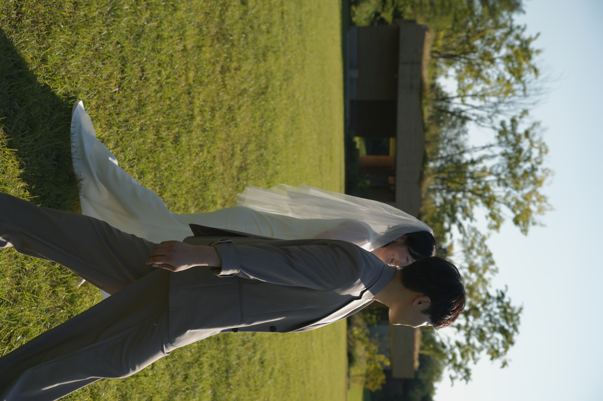

# 이준원 · 박소윤 모바일 청첩장

GitHub Pages로 배포하는 모바일 청첩장입니다.

---

## 1. GitHub Pages로 배포하기

1. GitHub에서 새 저장소(Repository)를 만듭니다.
   - 이름은 자유롭게 (예: `wedding-invitation`)
   - Public으로 설정 (Private은 GitHub Pages 무료 플랜에서 제한될 수 있어요)
2. 이 폴더 안의 파일들(`index.html`, `images` 폴더, `README.md`)을 저장소에 업로드합니다.
   - GitHub 웹사이트에서 "Add file → Upload files"로 드래그해서 올려도 되고,
   - `git` 명령어를 쓸 줄 아시면 아래처럼 하셔도 됩니다.
     ```bash
     git init
     git add .
     git commit -m "청첩장 초기 업로드"
     git branch -M main
     git remote add origin https://github.com/{아이디}/{저장소이름}.git
     git push -u origin main
     ```
3. 저장소 페이지에서 **Settings → Pages** 로 이동합니다.
4. "Build and deployment" 항목에서
   - Source: `Deploy from a branch`
   - Branch: `main` / 폴더: `/ (root)` 선택 후 Save
5. 몇 분 기다리면 아래 형태의 주소로 청첩장이 열립니다.
   ```
   https://{아이디}.github.io/{저장소이름}/
   ```

> 카카오톡 공유 등을 위해 주소를 더 짧게 만들고 싶다면, 네이버 me2.do, bit.ly 같은
> 무료 단축 URL 서비스를 이용하시면 됩니다.

---

## 2. 나중에 사진 추가하는 방법

지금은 `index.html` 안에 사진이 들어갈 자리마다 "사진을 준비 중입니다" 같은
점선 박스(placeholder)가 표시되어 있습니다. 사진이 준비되면 아래 두 군데를 수정하면 됩니다.

### (1) 사진 파일 넣기
`images` 폴더 안에 사용할 사진 파일들을 넣어주세요.
예:
```
images/cover.jpg      (표지 사진)
images/gallery1.jpg   (갤러리 사진 1 - 가로로 넓은 사진 추천)
images/gallery2.jpg   (갤러리 사진 2)
images/gallery3.jpg   (갤러리 사진 3)
```

### (2) index.html에서 플레이스홀더를 사진으로 교체

**표지 사진** — 아래 부분을 찾아서:
```html
<div class="cover-photo">
  <div class="cover-eyebrow">Wedding Invitation</div>
  <div class="cover-photo-label">
    <svg ...>...</svg>
    사진을 준비 중입니다
  </div>
</div>
```
이렇게 바꿔주세요:
```html
<div class="cover-photo">
  <div class="cover-eyebrow">Wedding Invitation</div>
  
</div>
```

**갤러리 사진** — 아래처럼 생긴 블록 3개를 찾아서:
```html
<div class="ph wide">
  <svg ...>...</svg>
  사진을 준비 중입니다
</div>
```
이렇게 바꿔주세요:
```html
<div class="ph wide" style="border:none;padding:0;">
  
</div>
```
나머지 두 개(`사진 추가 예정`)도 같은 방식으로 `gallery2.jpg`, `gallery3.jpg`로 바꿔주시면 됩니다.

> 사진은 가로/세로 비율을 미리 맞춰서 넣으시면 더 깔끔합니다.
> - 표지 사진: 3:4 비율 (세로로 긴 사진)
> - 갤러리 큰 사진(wide): 16:10 비율 (가로로 넓은 사진)
> - 갤러리 작은 사진 2장: 3:4 비율

---

## 3. 바꿔야 할 정보 체크리스트

파일을 열어서 아래 항목들이 실제 정보와 맞는지 확인해주세요.

- [ ] 예식 날짜/시간 (`countdown` 스크립트의 `target` 날짜도 함께 수정 필요)
- [ ] 예식장 이름 및 주소, 지도 좌표(`openNaverMap` 함수의 위도/경도)
- [ ] 주차장 안내 정보
- [ ] 신랑·신부 연락처 (전화번호)
- [ ] 계좌번호
- [ ] 양가 부모님 성함

---

## 4. 로컬에서 미리보기

인터넷에 올리기 전에 내 컴퓨터에서 먼저 확인하고 싶다면, `index.html` 파일을
더블클릭해서 웹 브라우저로 열면 됩니다. (인터넷 연결 없이도 대부분 정상적으로 보입니다.)
